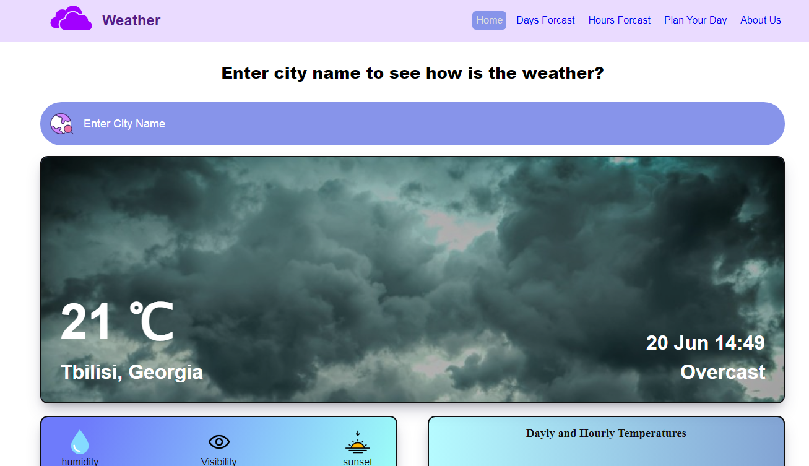
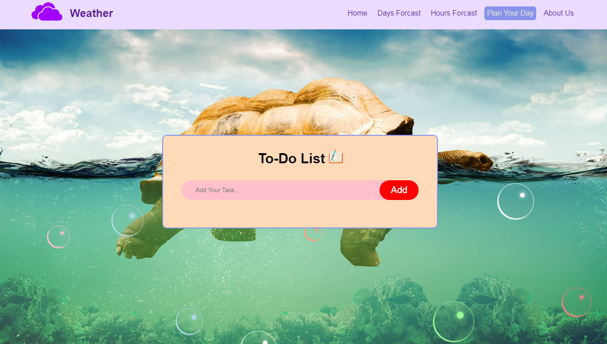

## Weather Web App

This is Weather Web app, where you can see current and forcast weather information. Also it has simple to do list to plan your day and bubble animation. This applicaiton is getting data from Weatherapi. The website is responsive. You can simply download this project and run it on localhost. For windows you can use XAMPP.

  

  

